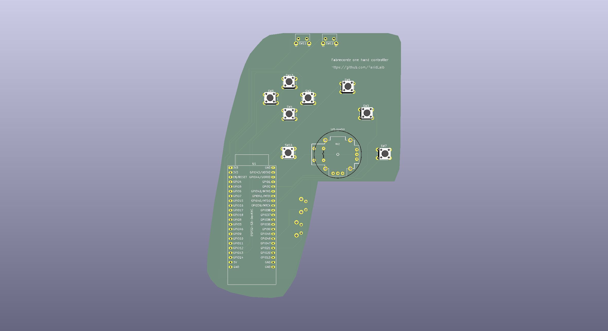
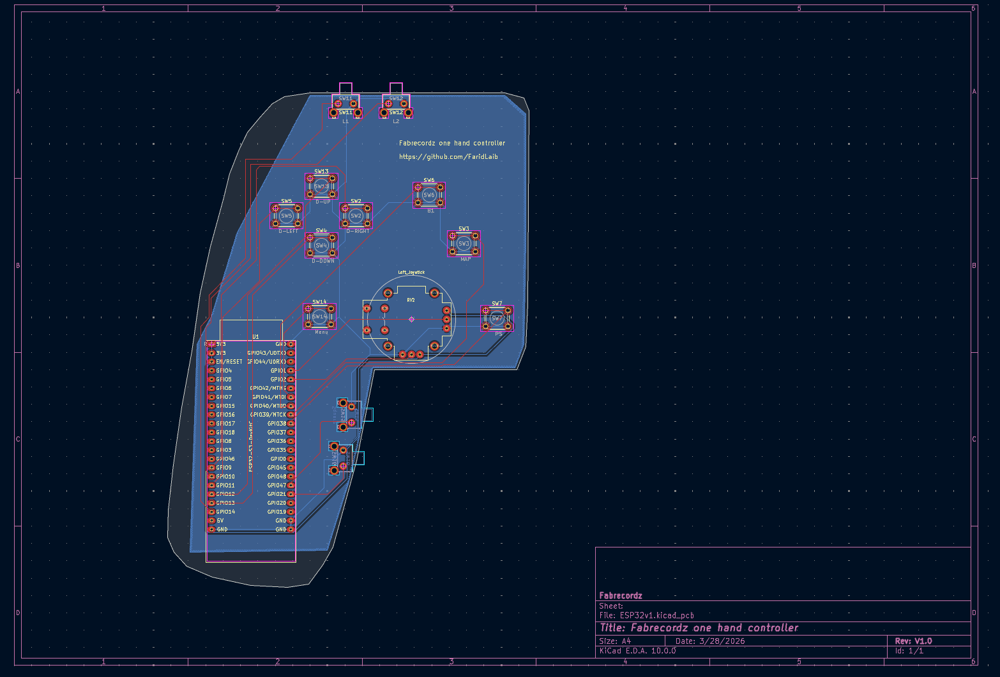
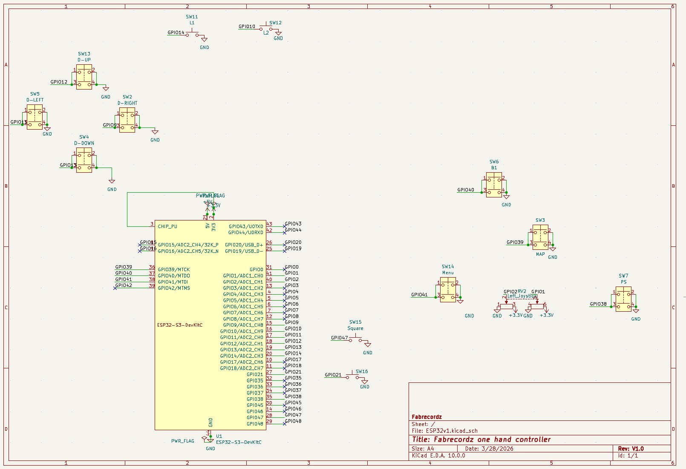

# ESP32 Gaming Controller PCB

A custom gaming controller PCB based on the **ESP32-S3-DevKitC**, designed in KiCad 10. Features one analog joysticks, a full D-pad, face buttons, shoulder buttons, and system buttons — all wired directly to ESP32-S3 GPIO pins.
I made a firmware that can show up as XINPUT, Xbox360 controller, Xbox One, DualSense PS5, DualShock PS4, and I'll design a Nintendo Switch soon. 

---

## 📦 Repository Structure

```
ESP32-Gaming-Controller/
Zip files for the entire project are included
└── README.md
```

---

## 🕹️ Hardware Overview

| Parameter        | Value                         |
|------------------|-------------------------------|
| Microcontroller  | ESP32-S3-DevKitC (U1)         |
| Board size       | ~128 × 175 mm (5.0″ × 6.9″)  |
| Copper layers    | 2 (F.Cu, B.Cu)                |
| Total pads       | 98                            |
| Vias             | 0 (single-layer routing)      |
| KiCad version    | 10.0.0                        |

---

## 🗺️ Pin Mapping

All buttons are wired active-low (one pin to GPIO, other pin to GND). The joysticks use analog inputs.

### Face Buttons

| Button    | Reference | GPIO    | Notes              |
|-----------|-----------|---------|--------------------|
| Square    | SW6       | GPIO15  | ADC2_CH4           |
| Triangle  | SW14      | GPIO16  | ADC2_CH5           |
| X         | SW9       | GPIO17  | ADC2_CH6           |
| Rectangle | SW10      | GPIO18  | ADC2_CH7           |

### D-Pad

| Direction | Reference | GPIO   |
|-----------|-----------|--------|
| D-Right   | SW2       | GPIO5  |
| D-Down    | SW4       | GPIO6  |
| D-Left    | SW5       | GPIO7  |
| D-Up      | SW13      | GPIO4  |

### Shoulder / Trigger Buttons

| Button | Reference | GPIO   | Footprint                        |
|--------|-----------|--------|----------------------------------|
| L1     | SW11      | GPIO8  | SW_Tactile_SKHH_Angled           |
| L2     | SW12      | GPIO9  | SW_Tactile_SKHH_Angled           |
| R1     | SW3       | GPIO10 | SW_Push_Dual (SW_PUSH_6mm)       |
| R2     | SW7       | GPIO11 | SW_Push_Dual (SW_PUSH_6mm)       |

### System Buttons

| Button | Reference | Notes                            |
|--------|-----------|----------------------------------|
| MAP    | SW3       | Dual-push footprint              |
| PS     | SW7       | Dual-push footprint              |

### Analog Joystick (Left)

| Signal              | Component | GPIO   | Notes              |
|---------------------|-----------|--------|--------------------|
| Left Joystick X     | RV2 pin 5 | GPIO2  | ADC1_CH1           |
| Left Joystick Y     | RV2 pin 2 | GPIO3  | ADC1_CH2           |
| Left Joystick VCC   | RV2 pin 3 / pin 6 | — | Connected to 3.3V |
| Left Joystick GND   | RV2 pin 1 / pin 4 | — | GND               |

> **Note:** A right joystick footprint (RV) is present in the schematic library but not placed in v1.

### Power

| Net   | Source         | Notes                         |
|-------|----------------|-------------------------------|
| +3.3V | ESP32-S3 3V3   | Pins 1, 2, 3 on U1; joystick VCC |
| +5V   | ESP32-S3 5V    | Pin 21 on U1                  |
| GND   | ESP32-S3 GND   | Pins 22, 23, 24 on U1; all switch pin 2s |

### Unused / Reserved GPIOs

The following GPIOs are broken out on the ESP32-S3 but not connected to any component in v1:

`GPIO0`, `GPIO1`, `GPIO12`, `GPIO13`, `GPIO14`, `GPIO19`, `GPIO20`, `GPIO21`, `GPIO35`–`GPIO48`, `GPIO43/TX`, `GPIO44/RX`

---

## 🧩 Bill of Materials (BOM)

| Ref       | Value / Part              | Footprint                        | Qty |
|-----------|---------------------------|----------------------------------|-----|
| U1        | ESP32-S3-DevKitC          | PCM_Espressif:ESP32-S3-DevKitC   | 1   |
| RV2       | Dual Potentiometer (Joystick) | ps2_joystick_buttons:Joystick | 1   |
| SW2–SW7, SW9–SW10, SW13–SW14 | Tactile Push Button 6mm | Button_Switch_THT:SW_PUSH_6mm | 10 |
| SW11, SW12 | Tactile Angled Button   | Button_Switch_THT:SW_Tactile_SKHH_Angled | 2 |

---

## 🏭 Fabrication

Gerber files are in the `/Gerber` folder and are ready to upload to your preferred PCB fab (JLCPCB, PCBWay, OSHPark, etc.).

| Layer file                  | Description              |
|-----------------------------|--------------------------|
| `ESP32v1-F_Cu.gbr`          | Front copper             |
| `ESP32v1-B_Cu.gbr`          | Back copper              |
| `ESP32v1-F_Mask.gbr`        | Front solder mask        |
| `ESP32v1-B_Mask.gbr`        | Back solder mask         |
| `ESP32v1-F_Silkscreen.gbr`  | Front silkscreen         |
| `ESP32v1-B_Silkscreen.gbr`  | Back silkscreen          |
| `ESP32v1-Edge_Cuts.gbr`     | Board outline            |
| `ESP32v1-PTH.drl`           | Plated through-hole drill|
| `ESP32v1-NPTH.drl`          | Non-plated drill         |
| `ESP32v1-job.gbrjob`        | Gerber job file          |

**Recommended fab specs:**
- Layers: 2
- Min trace/space: 0.2 mm / 0.2 mm
- Min drill: 0.3 mm
- Surface finish: HASL or ENIG
- Board thickness: 1.6 mm

---

## 🔧 Development Setup

1. Install [KiCad 10](https://www.kicad.org/download/)
2. Clone this repo:
   ```bash
   git clone https://github.com/YOUR_USERNAME/esp32-gaming-controller.git
   ```
3. Open `ESP32v1.kicad_pro` in KiCad

---

## 📋 Known Issues / ERC Notes

- `CHIP_PU` and `+3.3V` share a net — intentional (enable pin pulled high to 3.3V)
- Several GPIOs are labeled but not connected — reserved for future expansion
- Two minor off-grid endpoint warnings on power symbols (cosmetic only)

---

## 📸 Photos

### PCB Front


### PCB Back


### Schematic


## 📄 License

This project is open source. See [LICENSE](LICENSE) for details.
